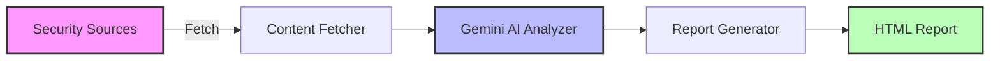

<div align="center">

# 🛡️ Daily_News

### Autonomous Threat Intelligence Monitoring System

*Powered by Google Gemini AI*

[](https://www.python.org/downloads/)
[](https://ai.google.dev/)
[](LICENSE)

**Monitor security sources. Get AI-analyzed threat intelligence. Daily.**

[Quick Start](#-quick-start) • [Features](#-features) • [Demo](#-demo) • [Automation](#-automation)

---

</div>

## 🎯 What It Does

Daily_News automatically monitors your configured security sources and generates comprehensive threat intelligence reports using Google Gemini AI.

```
📡 Fetch → 🤖 Analyze → 📊 Report
```

**One command. Zero manual work.**

## ✨ Features

<table>
<tr>
<td width="50%">

### 🔍 **Intelligent Analysis**
- Automatically classifies content types
- Extracts IOCs (IPs, domains, hashes)
- Identifies attack techniques
- Vulnerability impact assessment

</td>
<td width="50%">

### 📈 **Actionable Intelligence**
- Detection queries (KQL, EDR)
- Mitigation recommendations
- Exploit complexity ratings
- In-the-wild exploitation status

</td>
</tr>
<tr>
<td width="50%">

### 🎨 **Beautiful Reports**
- Dark mode HTML output
- Visual severity tags
- Organized by threat type
- Source links for verification

</td>
<td width="50%">

### 💰 **Cost Effective**
- Free Gemini API tier (1500 req/day)
- ~5-20 requests per run
- $0/month for typical usage

</td>
</tr>
</table>

## 🚀 Quick Start

### 1️⃣ Install Dependencies

```bash
git clone https://github.com/CertainlyP/Daily_News.git
cd Daily_News
pip install -r requirements.txt
```

### 2️⃣ Get API Key

Get your free Gemini API key: **[Google AI Studio](https://aistudio.google.com/app/apikey)**

### 3️⃣ Configure

**Create `.env` file:**
```bash
echo "GEMINI_API_KEY=your_api_key_here" > .env
```

**Edit `config.json` with your sources:**
```json
{
  "sources": {
    "twitter_accounts": ["vxunderground", "TheDFIRReport"],
    "article_urls": ["https://www.bleepingcomputer.com/news/security/"]
  }
}
```

### 4️⃣ Run

```bash
python main.py
```

**That's it!** 🎉 Open the generated HTML report in `reports/`

## 📸 Screenshots

### Dark Mode Report Interface
The system generates beautiful, dark-themed HTML reports optimized for security analysts:


*Main dashboard showing executive summary and statistics*


*Detailed vulnerability cards with CVEs, affected products, and mitigation steps*


*Comprehensive tool analysis with capabilities and detection methods*

> **Note:** Take screenshots of your generated reports and add them to `docs/screenshots/` directory for a visual preview.

### What You'll See

#### 📊 Executive Summary
- Total sources analyzed
- Actionable items count
- Content type breakdown
- Statistics cards

#### 🔓 Vulnerability Analysis
```
CVE-2025-XXXXX [CRITICAL] [EXPLOIT AVAILABLE] [EXPLOITED IN WILD]

Affected Products:
• FortiWeb 8.0 (8.0.0 through 8.0.1)
• FortiWeb 7.6 (7.6.0 through 7.6.5)
...

Attack Vector:
Authenticated OS command injection via crafted HTTP requests

Detection Methods:
• Monitor for crafted HTTP requests containing special elements
• Trend Micro security solutions detections

Mitigation:
Upgrade to FortiWeb versions 8.0.2, 7.6.6, 7.4.11...

Key Takeaway:
Immediate action required - actively exploited zero-day RCE...
```

#### 🛠️ Tool Analysis
```
ShinySp1d3r

Purpose: Ransomware-as-a-Service (RaaS) encryptor

Capabilities:
• Hooks EtwEventWrite to suppress Windows Event Logging
• Terminates processes holding file handles
• Wipes free disk space
• Self-propagation via WMI/GPO
...

Detection Methods:
• Monitor for file headers beginning with 'SPDR'
• Detect creation of 'wipe-[random].tmp' files
• Alert on EtwEventWrite API hooking
...
```

## 🤖 Automation

### Schedule Daily Reports

**Linux/Mac (cron):**
```bash
crontab -e
# Add this line:
0 9 * * * cd /path/to/Daily_News && /usr/bin/python3 main.py
```

**Windows (Task Scheduler):**
```powershell
# Create scheduled task
schtasks /create /tn "Daily_News" /tr "python C:\path\to\Daily_News\main.py" /sc daily /st 09:00
```

**Docker:**
```dockerfile
FROM python:3.9-slim
WORKDIR /app
COPY . .
RUN pip install -r requirements.txt
CMD ["python", "main.py"]
```

## 🧠 How It Works



1. **Fetch** - Scrapes configured blogs and Twitter accounts
2. **Classify** - Gemini determines content type (vulnerability, tool, technique, etc.)
3. **Extract** - AI pulls relevant IOCs, techniques, detection methods
4. **Generate** - Creates organized HTML report with visual formatting

## 📋 Content Types Supported

| Type | What's Extracted | Example Sources |
|------|------------------|-----------------|
| **IOC-Based** | Hashes, IPs, domains, detection queries | Malware analysis blogs |
| **Vulnerabilities** | CVEs, exploits, affected products, patches | Security advisories |
| **Tools** | Capabilities, detection methods, use cases | Tool releases, RAT analysis |
| **Techniques** | Attack vectors, detection gaps, mitigations | Security research |
| **Threat Actors** | TTPs, targeting, infrastructure patterns | APT reports |
| **Detection** | Queries, rules, telemetry sources | Detection engineering blogs |

## 🔧 Configuration

### Twitter Setup (Optional)

For Twitter monitoring, manual cookie setup is required:

```bash
python setup_twitter.py
```

Or manually create `twitter_session.json`:
```json
{
  "cookies": [
    {"name": "auth_token", "value": "your_token", "domain": ".twitter.com", "path": "/"},
    {"name": "ct0", "value": "your_ct0", "domain": ".twitter.com", "path": "/"}
  ]
}
```

Extract cookies from your browser: `F12 → Application → Cookies → twitter.com`

### Article Sources

Works with most security blogs:
- Bleeping Computer
- The Hacker News
- Krebs on Security
- SANS ISC
- Any RSS/article listing page

## 📦 Project Structure

```
Daily_News/
├── main.py                 # Main orchestrator
├── gemini_analyzer.py      # AI analysis engine
├── fetcher.py              # Content scraper
├── report_generator.py     # HTML report builder
├── setup_twitter.py        # Twitter auth helper
├── config.json             # Source configuration
├── requirements.txt        # Dependencies
└── reports/                # Generated reports
```

## 🛠️ Tech Stack

- **Python 3.8+** - Core language
- **Google Gemini API** - AI analysis
- **Playwright** - Twitter scraping
- **BeautifulSoup4** - Article parsing
- **HTML/CSS** - Report generation

## 💡 Use Cases

- **SOC Analysts** - Daily threat intelligence briefings
- **Security Researchers** - Track latest vulnerabilities and tools
- **Red Teams** - Stay updated on new techniques and TTPs
- **Blue Teams** - Get detection queries and hunting ideas
- **CISO Reports** - Executive summaries of threat landscape

## 🤝 Contributing

Contributions welcome! Feel free to:
- Add new source types
- Improve AI prompts
- Enhance report formatting
- Add integrations (Slack, email, SIEM)

## 📄 License

MIT License - feel free to use and modify.

## ⚠️ Disclaimer

This tool is for **authorized security research and monitoring only**. Respect rate limits and terms of service for all sources.

---

<div align="center">

**Built with ❤️ for the security community**

[⬆ Back to Top](#️-daily_news)

</div>
